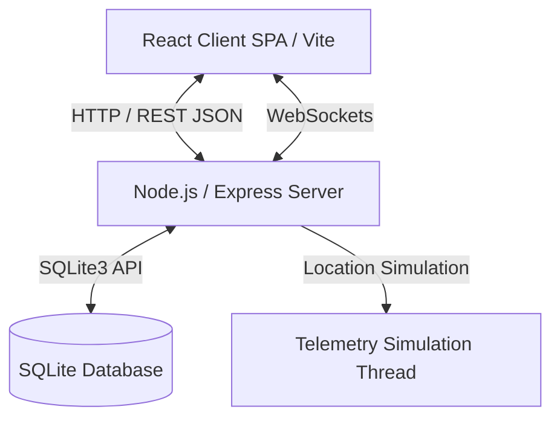

# TransitOps System Architecture

TransitOps is a modern, responsive Fleet and Logistics Command Center portal built with a decoupled client-server architecture. It supports live telemetry, automated route simulation, role-based security permissions, and premium glassmorphic visual designs.

---

## 🏛️ System Overview

### 1. Presentation Layer (Client)
- **Framework**: React 18 SPA powered by **Vite** for rapid bundling.
- **Styling**: Tailwind CSS for component styling combined with a custom design system in `index.css` leveraging CSS variables for glassmorphism, accent glow states, and dark/light modes.
- **Animations**: Framer Motion for premium component slide-ins, dropdown transitions, and hover elevations.
- **Icons**: Lucide React for consistent visual status badges.
- **State Management**: React Context (`AppContext.jsx` for vehicle/driver/trip collections; `AuthContext.jsx` for managing authentication & login token states).

### 2. Service Layer (Server)
- **Framework**: Express.js REST API with validation pipelines (`express-validator`).
- **Realtime**: WebSocket connection (`ws`) used to push live coordinate streams and vehicle status updates.
- **Simulation**: Background simulator loop updating location coordinates of active "On Trip" vehicles in real-time.
- **Security**: JWT-based stateless session management + Role-Based Access Control (RBAC) middleware verifying operation-level permissions against predefined policies.

### 3. Data Layer
- **Engine**: SQLite3 database (`sqlite3` module).
- **Structure**:
  - `users`: Operator profile, credentials hash, assigned role.
  - `vehicles`: Reg number, capacities, odometer data, status, active GPS coordinates.
  - `drivers`: License details, category check, expiry alert statuses.
  - `trips`: Route dispatch logs (source, destination, driver/vehicle links).
  - `maintenance_logs`: Vehicle service logs, costs, schedules.
  - `fuel_logs` & `expenses`: Operational financial auditing logs.

---

## 🔐 Role-Based Access Control (RBAC)

The portal implements strict role-based route protection. The four operational roles are:

| Role | Primary Functions | Permissions Profile |
| :--- | :--- | :--- |
| **Fleet Manager** | Full read/write management of vehicles, drivers, expenses. | Owner-level control |
| **Dispatcher** | Route optimizer, dispatching new trips, updating active routes. | Read-write trips, read-only system settings |
| **Safety Officer** | Monitors driver logs, license expiration checks, safety audits. | Read-only access, driver check |
| **Financial Analyst** | Audits fuel expense logs and compiles fleet financial reports. | Read-only access + full expense logging |
